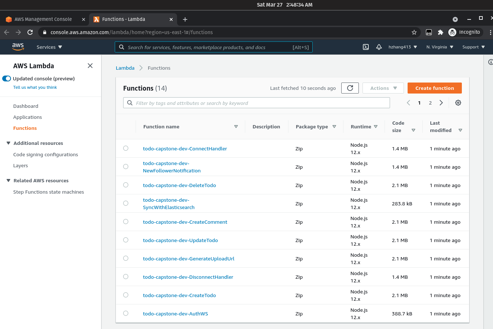
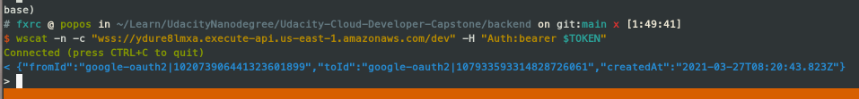
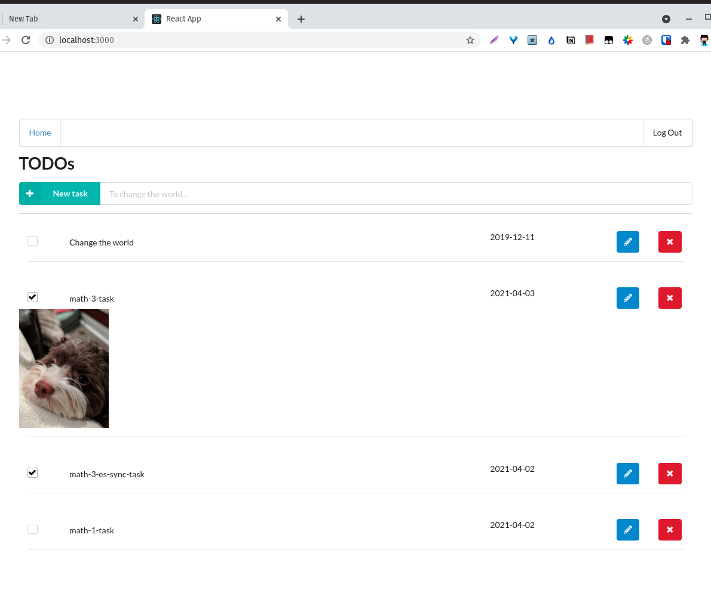
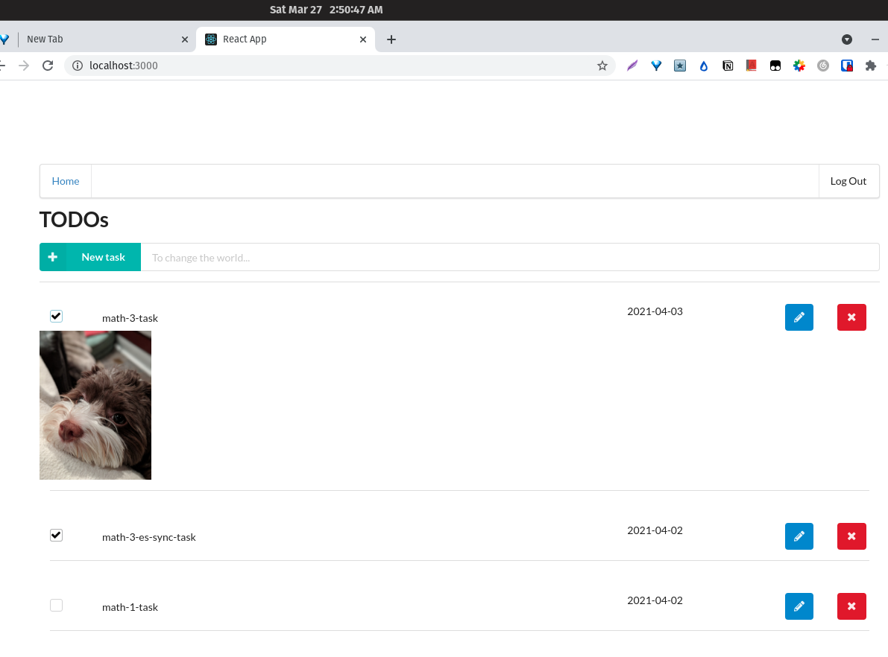
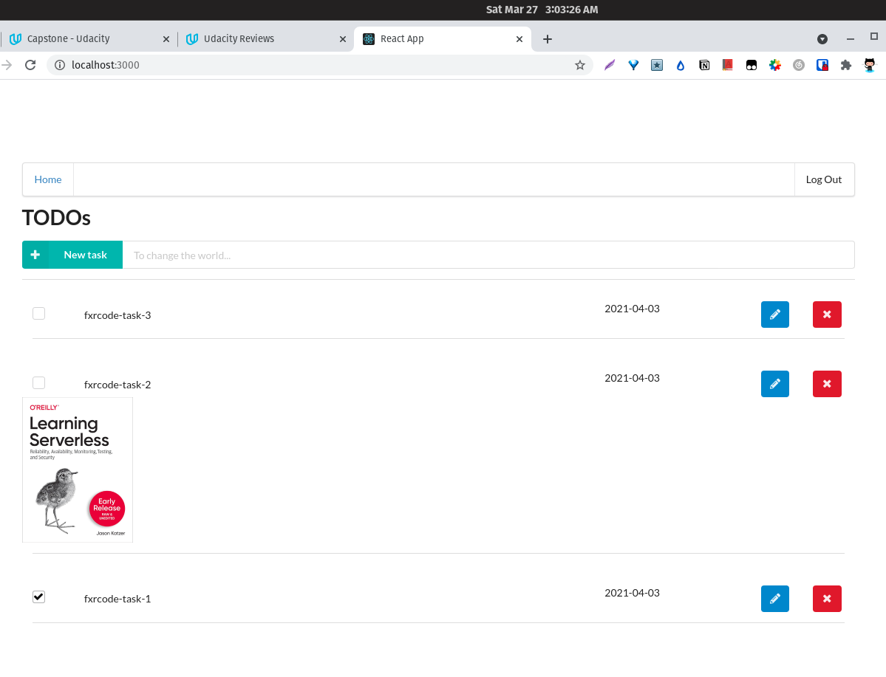
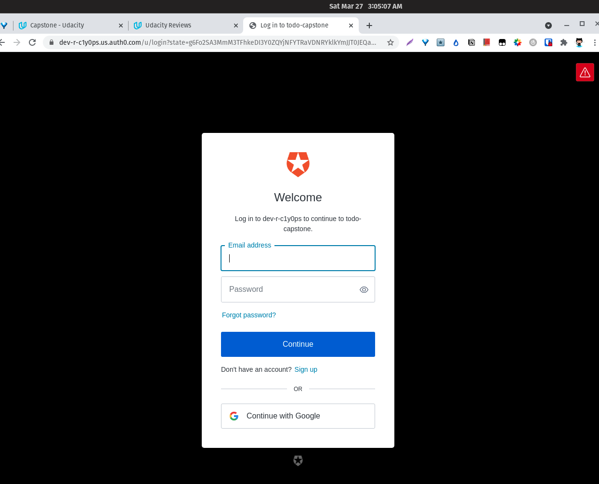
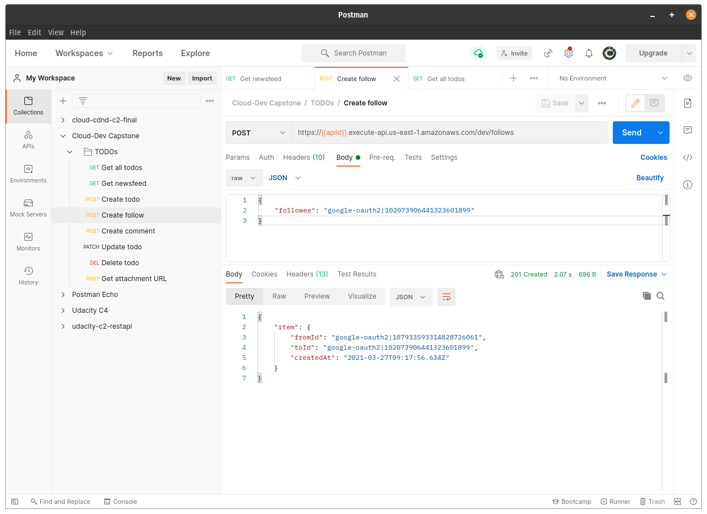
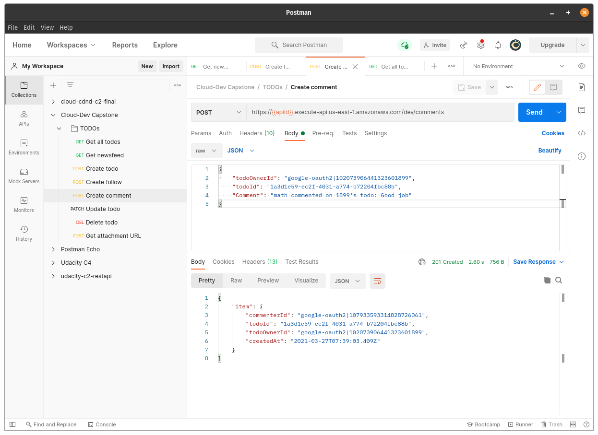
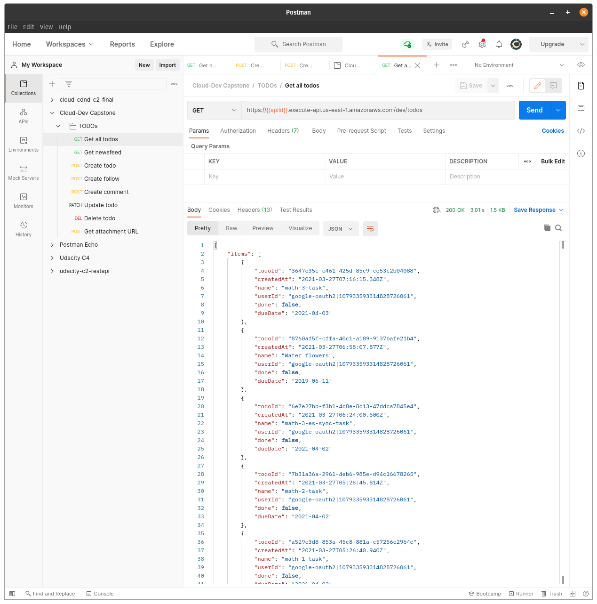
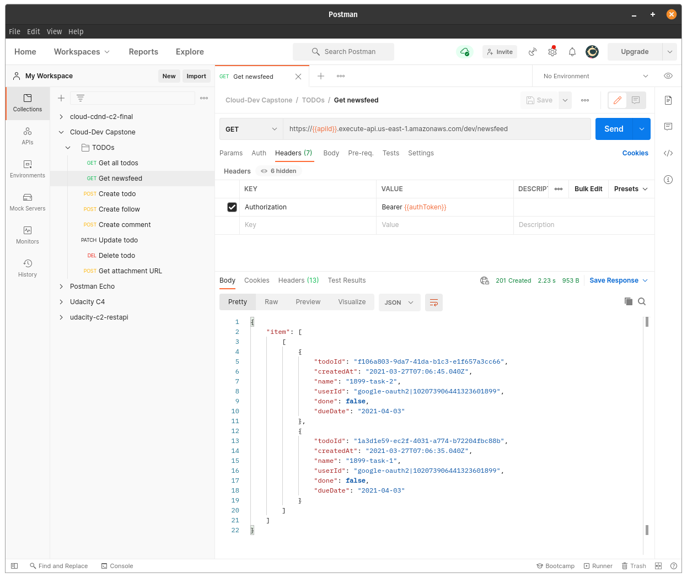

# Serverless TODO social network
* In this capstone project, I inherited from course-4 serverless TODO project, and extended with social network functionalitiy
    * able to follow other users.
    * able to see newsfeed (actually TodosFeed: followees's TODOs).
    * follower will be notified when someone followed you.
    * able to comment on others todos.
* I implemented in backend, and tested in postman. Please check the postman-collection file: `Cloud-Dev Capstone.postman_collection.json` to test.

# Issues
## Websockets
* There is a different mechanism than the standard HTTP headers; some abstraction layers implement a similar strategy. So I ported original HTTP's authorizer: `backend/src/lambda/auth/auth0Authorizer.ts` to handle Websocket authorization.
* for connection URL, I have to give speicific permission in the sendNotification function: `execute-api:ManageConnections`, so as to allow websocket operations: POST, DELETE and GET.

* I noticed one weird issue: some functions always got `internal server error` in 20 min. And I got them available later with any actions. But I only encountered this twice till now (30 deploys)
    * just encountered again when upload image. No log in `GenerateUploadUrl`. I'm able to upload 2 min later.
    * I guess the issue is with cold-start, since all functions are same size: 22.1MB! So I package individually to downsize to less than 2MB 

# Screenshots

*  Notify followee, once someone followed him/her, while followee is connected with websocket. 

* Create a new todo from UI 
* upload Image todo in UI 
* login with another gmail account in UI 
* auth0 login page in ui 
* create new Follow 
* create new comment 
* get all Todos 

* get newsFeed 